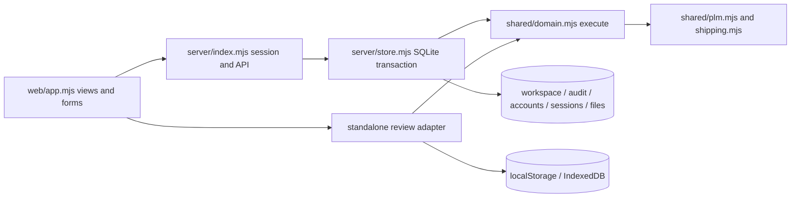

# Project learnings

## Production presentation integration - DEC-026

Wrap the reviewed theme and guide in mount functions to preserve separate scope when the standalone builder strips ESM imports. Keep one GUIDE_POSES manifest for runtime URLs and embedded standalone assets. Native serving must explicitly allow every module/CSS/PNG; test the experience entry point as well as app.mjs. Appearance storage failures should not break the app. Preserve authenticated APIs and startup, and never carry prototype FH_PREVIEW_SEED/storage initialization into web/ runtime. The review builder embeds assets; the server loads same-origin PNGs.

## Minimal theme prototype learnings - 2026-09-12

Reuse the real standalone application/domain for a functional sample, but isolate the localStorage/IndexedDB namespaces and seed illustrative records before startup. The generator never reads .env or live SQLite. Current/Minimal toggles presentation only. The preview's sample-data strip replaces the normal clean-seed banner to avoid an inaccurate claim that no sample POs are loaded.

Use disclosure for explanatory chrome and long timelines; preserve warnings, form hints, required labels, primary stage/actions, amounts and statuses. Animate main-page replacement only when route/tab identity changes, not on every filter input render; animate new dialogs once. Respect prefers-reduced-motion in both CSS and Web Animations. Retain existing colour/font/logo sources. Strip BOMs when concatenating CSS: an embedded BOM can invalidate the first :root declaration and break preview-strip offsets.

Prototype verified with 32 browser checks and syntax/build checks. A first test locator omitted the required-field marker; using the label prefix fixed the test, with no application changes. Production source remains untouched. See prototypes/minimal-theme/README.md and current browser report.

## Pipeline sorting/filtering - 2026-09-12

filteredOrders is shared by row pagination, current-page bulk selection, board lanes and CSV. It filters into a new array and sorts that array; never sort state.orders in place. Supplier ID is the filter identity, since names can duplicate. Sorting the current page alone would misorder pagination/export. Numeric S.No. remains independent of manual PO number; natural case-insensitive comparison handles PO-2/PO-10.

Sorting/filtering clears selectedOrders before re-render to avoid hidden admin selections. Header focus is restored after DOM replacement, while native selects provide mobile/board access. Search now includes supplier code alongside name. A Supplier name column is appended to CSV so existing column positions remain stable. Defaults and route/role reset behavior preserve current pipeline conventions.

Verification: 52 server/review sorting checks and 31 bulk regression checks, native startup graph and standalone build; database snapshots unchanged by view operations. C: disk space was reclaimed by archiving two earlier generated workflow trace ZIPs to D:/CodexTestTemp/FarmingHub/archived-c-traces/ after SHA-256 copy verification; original locations contain archive pointers. No database or source files were removed.

## Configurable approval stages - 2026-09-12

APPROVAL_STAGES is the 13-stage catalog for UI, defaults and validation; approvalRoles reads optional persisted approvalControls; canPerformApproval accepts workspace/order context without broadening canEdit/canApprove/canProductApprove. Admin edits the complete matrix atomically; default absence is backward compatible. New audit events carry approvalControl revision/command/roles, linking them to the append-only settings history.

Sample approval and initial-payment auto-authorization were previously editor shortcuts. Both now check their own configurable approval stage, retaining assigned Executive ownership by default. Technical approval and rejection require separate UI conditions; checking APPROVE_SPEC for both buttons would hide an independently granted rejection role. Browser coverage explicitly checks rejection-only access.

Manager-only coverage succeeds when artwork is granted via controls; restoring defaults removes the grant without reversing completed approvals. The full-flow test uses an explicit configured-policy fixture, then only Manager credentials for every order action. The dedicated controls browser test independently saves/restores the policy through UI in server and review modes. Direct-command test actions wait for rendered DOM replacement before checking visibility; a click alone can return before its asynchronous request finishes.

## Purchase Manager only workflow boundary - 2026-09-12

The three-scenario Manager-only browser run verifies that purchase authority does not include artwork approval. Manager can create/issue PO, verify/approve PI and submit supplier technical confirmation/artwork; APPROVE_ARTWORK is server-rejected for MANAGER. Pending artwork prevents production-window start. Do not report an entire single-role workflow as passing when a Product Manager/Admin handoff is required by B-19. The --manager-only runner creates only Manager credentials, checks actor audit identity and records BLOCKED_BY_ROLE separately from successful permission assertions. See [current report](WORKFLOW_BROWSER_TEST_REPORT.md); no business policy changed.

## Bulk deletion, stable serials and approval withdrawal - 2026-09-12

DEC-016 / WF-015: use recoverable order markers instead of removing rows, files, payments or events. Separate visibleOrders (active operations) from recordOrders (all scope-authorized retained records). getOrder uses retained records so finance links remain meaningful. Deleted-order detail has a dedicated read-only renderer; generic editable detail must not accidentally expose approval or payment controls. The server rejects deleted targets even for admins until restoration. Forwarder preview rejects a matched deleted PO, and uploads cannot link it.

ensureOrderSerials preserves valid existing serials and initializes missing values deterministically. Store startup backs up a non-empty legacy DB with VACUUM INTO before an atomic metadata/audit migration; new creates use nextOrderSerial in the same revision transaction. Serial is not PO number, table row index, count of active orders or issued revision. Retain high-water value and deleted records; do not reuse numbers.

DEC-017 / WF-016 removes the September executive delegation, not the expiry alone. The request followed adding Manager role editing; this interpretation was stated before implementation. Standard purchase/product approval roles now apply without date checks. Past events remain unchanged. Existing executive sample/initial-payment exceptions are not expanded or removed.

Verification: native permission/retention/migration tests plus server/review bulk selection, cancellation, restore, mobile, immutable history and financial visibility; standard approval UI tests; complete Executive workflow with actual manager/product handoffs. A local disk-full event interrupted a write/test run; app source was recovered from the generated review, checked and browser-tested again. Temporary DBs/browser artifacts now support FH_TEST_OUTPUT_ROOT and this run used the available D: test directory. Only a prior failed-test trace was removed; real databases were untouched.

## Role editing - 2026-09-12

CHANGE_USER_ROLE is profile metadata, so reuse shared execute and /api/commands rather than credential-specific /api/users. Store.session and Store.transact already read current profiles; role changes affect existing authenticated sessions without persisting role claims in cookies. Do not rewrite accounts/password hashes or reassign owned orders. Preserve scopes and audit the change, unlike the older SAVE_SCOPES exception. The browser refreshes its current actor from returned state after commands.

User access rows now reuse the standard Change role button, labelled select, role help, reason textarea and shared dialog. Self-role editing is hidden and server-blocked. Real-account creation stays unavailable in standalone mode; role changes there affect sample profiles only.

## Temporary approval delegation - 2026-09-12

DEC-014 / WF-013 implements the confirmed September exception for both purchase and product approvals. Existing canApprove also governs vendor/route/category maintenance, editing, cancellation and short closure; canProductApprove also governs templates and uploads. Broadening either helper would silently grant unrelated powers. Use the separate command-specific canPerformApproval allowlist in domain and UI.

Use explicit IST timestamps and an exclusive October boundary, not process/browser timezone or payload dates. The trusted execute context supplies now; Store.transact re-reads the persisted actor. Delegated events retain identity and add policy metadata. No account role/schema changes. PLM target scope is checked as well as general PLM eligibility. Self-approval and cross-owner approval within scope are temporary permissions; cross-owner editing stays restricted.

Verification covers all 11 delegated commands, immutable snapshots, readiness gates, expiry, denied roles/scopes, forged dates, SQLite audit persistence, a complete Executive-only purchase lifecycle, and server/review UI with mobile and open-page expiry. Historical handoff results below describe the earlier policy. Browser PLM tests should select a specification ID explicitly: newest-first rows can make the first button refer to another pending revision.

## Complete browser workflow verification — 2026-09-12

The three full workflow scenarios and dedicated Purchase Executive run passed; see [workflow browser report](WORKFLOW_BROWSER_TEST_REPORT.md). The executive can operate its assigned PO through port arrival and settlement with existing manager/product approval handoffs. Initial-payment auto-authorization and sample approval remain editor capabilities under the existing implementation; do not silently redefine them as manager-only based on terminology.

For UI tests, target `.tab[data-value=finance]`: both a next-action shortcut and the actual tab use `data-action=tab`/`data-value=finance`, causing ambiguous broad selectors. Use per-shipment IDs for card actions when testing partial shipments. Select only allocated outstanding payment milestones, and exercise BL payments after a final BL exists. Keep test accounts, traces and databases isolated; reports should distinguish fixture setup, real UI actions and read-only database assertions.

## Multiple-file upload update — 2026-09-12

DEC-013 / WF-012: evidence limits now use shared `MAX_UPLOAD_BYTES` (52,428,800 bytes) and `UPLOAD_EXTENSIONS`. Existing JSON/base64 upload transport remains: one file per HTTP request, request budget `ceil(MAX_UPLOAD_BYTES / 3) * 4 + 1 MiB` for encoding and metadata; decoded bytes enforce the actual per-file limit. Other API bodies retain 12 MiB. Spreadsheet source parsing uses the same per-file size while keeping its single-source preview workflow.

Most workflow dialogs previously read only `FormData.get('file')`. Their shared picker now allows multiple files, and submission reads the actual FileList (distinguishing no selection from a selected empty file). `uploadMany` validates the entire selection first, uploads sequentially, displays file-count progress and caches successful IDs by File object, actor and order links for retry in the same form. A separate submission guard covers the upload phase before the command busy guard; double-submit cannot produce duplicate workflows. Uploads are individually committed/audited; the business command runs only after all selected uploads succeed. Abandoning a partial upload may leave uploaded evidence metadata/BLOBs, consistent with the pre-existing two-step store model; no automatic destructive cleanup is introduced.

`dEvidence` accepts an old scalar ID or a collection and validates every file; `dAttach` creates a separate order-document row for every attachment. Records retain the first `fileId` for compatibility plus the full `fileIds` collection (supplier realization uses `ackFileIds`). Multi-order payment validation checks every proof against every allocation. PI, artwork and receipt buttons expose all files; PLM artwork collections also have download controls. Existing workflow gates, roles, calculations and schema version remain unchanged.

Verification: 102 native tests pass, including exactly 50 MB accepted, 50 MB + 1 byte rejected without state change, grouped responses/PI/documents/payment evidence, scope failures and old single-file compatibility. Isolated browser checks cover full-selection validation before network writes, partial failure/retry without duplicate files, duplicate-submit protection, mobile layout, and standalone review/IndexedDB uploads. The user-access browser regression also passed after the shared form submit handler changed.

## User access portal update — 2026-09-12

DEC-012 / WF-011 adds administrator account creation to the existing settings page. Reuse `Store.createLocalAccount` for both web and CLI: it whitelists profile fields, validates name/email/password/roles/scopes, deduplicates scopes, uses existing scrypt and commits profile/account/audit atomically. The web caller passes authenticated actor ID and expected workspace revision. `USER_ROLES` in shared/domain.mjs centralizes the supported role inventory; permissions retain their existing helpers.

Credentials require a distinct `/api/users` resource rather than a generic business command because shared commands also run in browser review mode and produce workspace history. GET returns only safe account/profile metadata to ADMIN; POST also requires Origin/CSRF. Never persist form passwords in workspace/UI storage, events or responses. The authenticated administrator is the creation audit actor; scope toggles keep their existing audit exception.

UI reuses `head`, `button`, `field`, `checkbox`, shared modal/footer/error handling and the existing settings table. Password confirmation and division selection happen before the request. Failed validation preserves fields. Account-list requests carry a sequence/actor guard and do not re-render over an open form. After creation, replace state from the server response and invalidate older list requests. New users can sign in immediately. Standalone review has no account-creation control; no invitation/reset flow exists.

Verification: 97 native tests passed; isolated Playwright/Chrome checks cover creation, password mismatch, duplicate rollback, mobile dialog, successful new-user login, non-admin visibility and standalone settings. No real users were created by tests. See `tests/server.test.mjs` and `tests/user_access_browser_flow.mjs`.

## Initial documentation evidence

Recorded 2026-09-12 from source at `ced3d3b`, tests, bundled release records, recovered Git bundle and the current development conversation. Observations below describe implementation, not retrospective business approval. Follow the [rulebook](PROJECT_RULEBOOK.md) before changing them.

## Architecture learnings

The active app has no npm runtime dependencies. It needs Node >=22.16 for native `node:sqlite`; this workstation used Node 24.19.0 and the deployment image uses `node:24-bookworm-slim`. Browser JSZip is vendored with its license. There is no React, bundler, ORM, Express, TypeScript, hook system, service worker or external state manager in the active product.

| Location | Responsibility / dependencies |
|---|---|
| [web/app.mjs](../web/app.mjs) | HTML-string views, hash navigation, UI state, delegated actions, modal forms, workbook parsing, downloads and PO printing. Uses shared rules for server and clean-review modes. |
| [web/styles.css](../web/styles.css) | Base styles followed by historical and current brand overrides. Cascade order matters. |
| [server/index.mjs](../server/index.mjs) | Native HTTP routing, auth/origin/CSRF checks, scoping, file/static allowlists, startup and shutdown. |
| [server/store.mjs](../server/store.mjs) | SQLite workspace snapshot, append-only event mirror, accounts, sessions and evidence BLOBs. |
| [shared/domain.mjs](../shared/domain.mjs) | Command interpreter, permissions, validation, money/dates, approval/production/shipping rules, status and warnings. |
| [shared/plm.mjs](../shared/plm.mjs) | Five seed templates and pure field-description/QC/PO/confirmation projections. |
| [shared/shipping.mjs](../shared/shipping.mjs) | Forwarder import normalization, exact route matching, freight benchmarks/trends, document readiness. |
| [shared/clean-seed.mjs](../shared/clean-seed.mjs), [shared/final-master-data.mjs](../shared/final-master-data.mjs) | Approved-source master snapshots and empty transaction initialization. Applied on initial creation, not an automatic existing-database migration. |
| [shared/seed.mjs](../shared/seed.mjs), [shared/source-items.mjs](../shared/source-items.mjs) | Illustrative test data, not server production seed. |
| [scripts/build.mjs](../scripts/build.mjs) | Concatenates shared modules in dependency order after stripping imports/exports, embeds CSS/JSZip/logo/template into standalone clean-review HTML. Named export additions and multiline imports can break this approach. |
| [scripts/add-user.mjs](../scripts/add-user.mjs), [scripts/backup.mjs](../scripts/backup.mjs) | Local database account administration and consistent `VACUUM INTO` backup. Not browser registration or a remote admin API. |
| `templates/`, `docs/reference/`, `docs/brand/` | Import templates, source workbooks and official brand assets. Do not mistake historical samples for current transaction records. |
| `vms-reference/` | Recovered React/Vite/Tailwind + Express/Prisma/PostgreSQL/JWT source, not an active dependency. Its README/runtime assumptions must not leak into Purchase. |

### Persistence and identity

SQLite has five tables: `workspace(id=1,revision,payload)` stores the entire JSON state; `audit_events(id,entity_type,entity_id,at,payload)` mirrors new events; `accounts(id,email,password_hash,active)`; `sessions(token_hash,account_id,csrf,expires_at)`; `file_bodies(id,body)` stores evidence bytes. WAL, foreign keys and 5-second busy timeout are enabled. SQL uses prepared statements. Audit triggers reject UPDATE/DELETE; commits also compare the prior event prefix.

`transact` clones/executes under `BEGIN IMMEDIATE`, checks the expected revision, then commits all state/events or rolls back. The JSON snapshot model is simple but all reads deserialize and all writes replace the workspace; do not call it a normalized scalable production schema. `SCHEMA_VERSION=7` is the product/review state version; no seven-step SQL migration suite exists.

Passwords are salted scrypt hashes, not encrypted passwords. Sessions use random 32-byte tokens, stored SHA-256 token hashes, separate 24-byte CSRF tokens and 8-hour expiry. Both account and profile must remain active. Login normalizes email and uses a constant-time password comparison. Login throttling is in-memory by socket IP (10 failed attempts per minute); reverse-proxy clients may share that IP. Cookies are HttpOnly, SameSite=Strict and Secure when configured. Origin checks precede all API writes; authenticated writes also require CSRF. Do not replace this with the reference VMS's JWT scheme without a deliberate migration.

`scopedState` clones the workspace and filters several entity collections. It is not a fully generic scope serializer: see the baseline's permission/scoping risks. Scope means division/purchase type, not category. Buyer assignment additionally limits executive edits.

### Runtime differences and startup lesson

Server mode loads `/mode.js`, then `/app.mjs`, boots through `/api/bootstrap` and shows login on bootstrap failure. Clean review mode sets `FH_MODE='clean'`, uses `localStorage` key `fh-purchase-alpha15-clean-schema7`, role selection (not authentication) and IndexedDB `fh-purchase-alpha10-clean-files`. A schema mismatch discards the saved review state during startup; that is not a server migration strategy. Browser storage events refresh review tabs; the server UI has no background refresh/websocket system.

The 2026-09-12 startup hang occurred because `clean-seed.mjs` imported `final-master-data.mjs` but the server omitted its static route. Fixed in `7507416`; `tests/startup.test.mjs` now traverses static import declarations. A healthy API alone does not prove the browser module graph works. Every new shared browser module must also be added to the server allowlist and standalone build where applicable.

## Coding and reusable patterns

Use functions and plain objects, named ESM exports, camelCase fields, uppercase command/status constants, ISO dates, and `*Minor` monetary fields. `execute` receives optional deterministic `now`/`id` for tests; returns `{state,result}`. Internal helpers include `dFindOrder`, `dLines`, `dTerms`, `dEvidence`, `dAttach`, `dEvent`, `dSnapshot`, `dActual`, `dLate` and `dRefreshProductionWindow`.

Transport adapters call shared domain code; they should not recreate its rules. UI `command()` owns busy state, state replacement, render, errors and toast. `api()` adds credentials/CSRF and unwraps JSON. `upload()` saves evidence before a command; a failed subsequent command can leave an unattached file (recorded debt). Exceptions use `RuleError` with stable codes; generic server failures conceal private details from clients. Correcting an event appends a linked correction rather than rewriting the old record.

Source files are unusually dense (many entire functions on one line). Reformat only in a scoped change; code review of unrelated functional changes must remain possible. `scripts/build.mjs` relies on source text patterns and import order, so moving declarations is not automatically harmless.

## UI/UX learnings

- Shared rendering helpers: `icon`, `button`, `badge`, `field`, `moneyField`, `fileField`, `multiFileField`, `checkbox`, `head`, `ph`, `kpi`, `kv`, `note`, `empty`, `pageButtons`. These are functions returning markup, not component files.
- `ui` stores route/detail selection, active tabs, shared search/status/category/page, layout, modal and draft/import state. Business state/user/CSRF are separate variables. Delegated click/change/input/submit handlers map `data-action` and form values to commands.
- `navigate` closes dialogs/drawer; hash routing resets search/status/page. Topbar search on Enter chooses the first visible PO substring match; otherwise renders Item master with the query. Per-page search re-renders and restores caret. No server search or universal sort API exists.
- Order table pages use 12 rows; board renders grouped full filtered results. Other views use complete arrays or explicit slices, not one global pagination component. Do not claim click-to-sort everywhere.
- Dialogs share Cancel then submit in the right footer, labelled controls, scrollable bodies, Escape handling and a Tab loop. The code does not establish a complete focus-return/unsaved-change-warning policy. `command` guards duplicate submissions, but pre-command evidence uploads and the login form do not have the same guard.
- `toast` replaces the prior toast for 6.5 seconds. Modal errors are inline and scrolled into view; errors outside modal use toast. Boot text and `empty()` provide loading/empty/error presentation. Bootstrap treats all failures as login, which can hide network failure context.
- File evidence allows PDF, PNG/JPG/JPEG/WebP, TXT, DOCX, XLSX, CSV and EML, <=8 MiB, with MIME chosen from extension on the server. General file picker omits CSV though upload permits it. No malware scanner/content sniffing is implemented. XLSX/CSV parsers are preview tools, not spreadsheet recalculation engines.
- Workbook parser reads shared strings/inline strings and cached cell values; scans the first 30 rows of sheets for expected headings. Limits: 8 MiB input, <=4,000 ZIP entries, <=40 MiB declared expansion; max 2,000 item / 1,000 tracking / 500 rate rows at domain commit. No binary XLS support. CSV handles quoted fields and comma/semicolon detection; export prefixes potentially executable spreadsheet cell content.
- Pipeline, stage timeline and next-action controls derive progress in different functions. Preserve the domain gate as authority; a visible step alone is not an enforceable gate.

## Business workflow learnings

The [baseline](CURRENT_PRODUCT_BASELINE.md) inventories pages/commands; [workflow history](WORKFLOW_CHANGE_LOG.md) records the actual sequence and evolution. Key distinctions:

1. Base specifications, ERP Item artwork, PO revision, software version and freight week are separate namespaces.
2. PO issue snapshots supplier/commercial/specification/price context; later master changes never rewrite those snapshots. Amendments preserve former revisions and invalidate relevant current acknowledgements/PI status.
3. No approved PLM at all is warning-only; a missing selection where approved PLM exists is a block. Pending brand deltas and the configurable pending-new-version gate still apply.
4. Reported payment can start production; supplier realization remains financial follow-up. Do not equate the two or automatically net excess across orders.
5. Shipment booking is parallel with active production. Current mandatory pre-vessel documents are CI/PL. Legacy `RECORD_QC` and BL-draft commands remain available but are no longer mandatory dispatch gates.
6. Forwarder reports annotate tracking/estimated dates and reported BL information; they do not execute actual dispatch/port closure or create inventory.
7. Existing routes' `transitDays:1` are reference placeholders, not approved China-to-India transit times. Manual planning TAT must remain explicit.
8. Complaint roll-ups count complaint records by brand/severity, not failed quantities or defect rate. The current app records OPEN complaints; a full resolution lifecycle is not implemented.

## Calculation contracts

The following are **observed implementation contracts**. They are preserved by the confirmed consistency policy. A requested formula change needs a decision, dependency review and representative tests. No tax/GST/discount/margin assumptions are implied by a PO total.

### CAL-01 — Monetary input and display

**Purpose:** avoid binary floating-point transaction input errors. **Formula:** `toMinor("A.BB") = BigInt(A)*100 + padded cents`; `major(n)=(Number(n||0)/100).toFixed(2)`. **Inputs:** non-negative decimal string, at most two decimals. **Outputs/units:** safe integer minor units, or two-decimal major-unit string. **Rounding:** input is rejected rather than rounded; display uses JS formatting. **Edge cases:** empty/negative/exponent/comma/three-decimal inputs rejected; value <=1e12 minor units. `major` and `formatMoney` coerce null/zero to zero. **Example:** `12.3 -> 1230 -> "12.30"`. **Source/dependencies:** `toMinor`, `major`, `formatMoney` in domain; PO/PI/payments/costs/pricing/insurance/UI/print/export. `formatMoney` uses `en-IN` and requested currency.

### CAL-02 — Fixed-point FX

**Purpose:** record transactional FX independently of any current market rate. **Formula:** `toRate(x)=x*1,000,000` parsed as integer; `convertMinor(a,r)=floor((a*r+500000)/1000000)` with BigInt arithmetic. **Inputs:** non-negative minor amount; positive rate with <=6 decimals, target-major units per source-major unit. **Output/units:** target currency minor units. **Rounding:** nearest minor unit, positive halves upward. **Edge cases:** zero rate/negative/malformed rate rejected; output must be safe integer. Same invoice/remittance currency uses 1,000,000; generic INR remittance requires INR/INR=1. Initial-payment shortcut lacks that explicit INR check (debt). **Example:** USD 100.00 at INR 83.123456/USD -> INR 8312.35 (831235 minor). **Consumers:** bank INR equivalent and invoice expected allocations. Supplier `realizedMinor` is separately entered; a supplier rate does not automatically replace actual realization.

### CAL-03 — PO value and quantity expansion

**Purpose:** commercial order amount. **Formula:** `sum(line.quantity * line.unitPriceMinor)`. UI expands each Base Item's positive GJ/KD/TT quantities into separate ERP lines with shared entered base price/spec selection. **Inputs:** 1-100 unique ERP lines, integer quantities 1-10,000,000, non-negative minor price. **Output/units:** invoice-currency minor total; ERP quantities in whole units. **Rounding:** none after integer inputs. **Edge cases:** zero price may exist in draft but blocks issue; aggregate must be safe and <=1e12; no brand duplication; absent matching ERP variant is skipped by UI expansion, while domain validates submitted lines. **Example:** GJ 2 + KD 3 at USD 10.25 = 5125 minor (USD 51.25); TT zero creates no line. **Consumers:** PI matching, snapshots, schedules, financials, reports. No automatic tax or conversion between price-list and billing currencies is applied.

### CAL-04 — Exact proportional allocation

**Purpose:** preserve every cent when splitting terms/remittances/shipments. **Formula:** for total T, weights wi and W=sum(wi), cumulative target i = `floor((T*sum(w0..wi)+floor(W/2))/W)`; slice = target minus previously allocated target. **Inputs:** integer total and non-negative integer weights from validated callers. **Output/units:** slices in same minor units as T. **Rounding:** cumulative nearest-integer allocation; do not independently round each line. **Edge cases:** all-zero weights return all zeros; input order affects where the rounding cent lands. **Example:** T=100, weights [1,1,1] -> [33,34,33]. **Source/consumers:** `proportionalSlices`, payment terms, remaining shipment reserve, initial payment splitting.

### CAL-05 — Payment schedule amounts and due dates

**Purpose:** derive original-PO obligations and shipment credit dates. **Formula:** term amounts = CAL-04(PO total, percentages); for SHIPMENT/BL terms split each amount over active shipment line values plus unallocated remainder. PI due=PI approval day + credit days; BL due=that shipment's final BL date + days; SHIPMENT due=current ETD (step.days is not used there). **Inputs:** 1-9 steps, integer percent 1-100 totaling 100; credit days 0-365; active shipment quantities/prices. **Outputs/units:** invoice minor amount, date or null, reported/paid sums, authorization by current PO revision. **Rounding:** CAL-04; calendar-day addition. **Edge cases:** missing PI/BL/allocation -> null due/awaiting trigger; cancelled shipments excluded; unallocated remainder remains visible. **Example:** USD 1000, 30/70 terms -> 300/700; shipment values 400/600 split 70% balance into 280/420. A 2026-09-12 BL +60 days is 2026-11-11. **Source:** `paymentSchedule`, `dTerms`, `TERMS`; consumers payments, dispatch gate, overdue flags.

### CAL-06 — Financial balances

**Purpose:** distinguish payment reporting, supplier receipt and original-order settlement. **Formula:** reported=sum(expectedMinor); realized=sum(realizedMinor or 0); balance=PO total-realized; pending=count(realizedMinor === null), excluding VOID payments. **Outputs/units:** invoice minor amounts, pending count, status. **Rounding:** none beyond inputs/conversion. **Edge cases:** SETTLED only balance=0 and pending=0; negative balance -> EXCESS TO SETTLE; else reported>0 -> PARTIALLY PAID, otherwise UNPAID. Paid-in-full but unacknowledged remains pending. **Example:** total 100000, reported 100000, actual 99000 -> balance 1000; actual 101000 -> excess 1000. **Source/consumers:** `allocationsFor`, `financials`; order/payment views, warning/reporting and financial follow-up. Bank charges are separately recorded INR minor values, not silently added to invoice settlement.

### CAL-07 — Initial-payment readiness / production clock

**Purpose:** start supplier production time after commercial readiness. **Formula:** every PI-triggered milestone has reported>=amount; completion date is latest related payment date. With no PI steps, current approved PI/PO acknowledgement/technical/artwork confirmations establish readiness. `productionDue=addDays(start,productionDays)`; baseline initialized once. **Inputs:** current confirmations, payment schedule and reported allocations. **Output/units:** boolean, ISO date, calendar-day due date. **Rounding:** none. **Edge cases:** supplier realization can remain pending; existing production window does not recompute after later payment corrections/voids; no-advance starts at current command date when ready. **Example:** final advance reported Sep 12 with 30 days -> Oct 12 due; sample approval Sep 15 does not restart the clock. **Sources:** `initialPaymentStatus`, `dRefreshProductionWindow`, payment/artwork/technical commands.

### CAL-08 — Production reference and override

**Purpose:** compare agreed production commitment against product/supplier references. **Formula:** maximum positive item productionDays among submitted lines, else supplier productionDays, else domain fallback 30. UI uses selected base productionDays, else vendor, else 0. **Inputs:** days per product/vendor and order commitment. **Output/units:** positive whole calendar days and override-required flag. **Rounding:** none; integer validation for order input. **Edge cases:** different UI/domain representations can diverge; actual persisted order captures reference/source/reason. Reason needed only when agreed days differ. **Example:** items 20/35 and vendor 30 ->35 reference; commitment 40 requires reason. **Consumers:** `productionReferenceDaysForOrderInput`, `productionReferenceForDraft`, create-order form/domain. Duplication is debt, not a new approved rule.

### CAL-09 — Dates, delay, planning and reminders

**Purpose:** consistent calendar calculations. **Formula:** `daysBetween(a,b)=round((UTC-noon(b)-UTC-noon(a))/86400000)`; delay=max(0,daysBetween(baseline,actual)); planning warning if daysBetween(created day, requested port day)<manual TAT. **Inputs:** valid YYYY-MM-DD strings; actual dates cannot be future or earlier than command-specific minimum. **Outputs/units:** whole calendar days/ISO dates. **Rounding:** rounded day difference; UTC-noon arithmetic avoids local DST. **Edge cases:** no holiday/business-day engine; today is UTC via `isoDay`, display uses `en-GB` with noon date construction. Original production/ETD/ETA baselines remain. **Example:** baseline Sep 12, actual Sep 15 ->3 delayed days, reason plus remarks required; Sep 10 ->0 with remarks still required. Recurring follow-up default is +7 days or +3 when frequency=2; next follow-up must be within 7 days and not past. Booking task due=ETD-bookingLeadDays (default10); overdue means <today, due-soon <=warningDays (default3).

### CAL-10 — Shipment quantity and operational status

**Purpose:** prevent over-allocation and preserve partial order fulfillment. **Formula:** required=sum(PO quantities); allocated=sum(non-cancelled shipment quantities); departed/arrived=sum such shipments with actualDeparture/actualArrival. Available per line=ordered-active allocations. **Inputs:** whole units; unique PO line within shipment. **Outputs/units:** unit counts and derived stage. **Rounding:** none. **Edge cases:** manual short close has highest status precedence; full arrival only if required>0 and arrived>=required; partials remain open. Financial balance not consulted. **Example:** required10, allocation6 departed, 4 unallocated ->IN_TRANSIT; only6 arrive ->PARTIAL_ARRIVAL; all10 arrive ->PORT_ARRIVED. **Sources:** `shipmentTotals`, `orderStatus`; pipeline, quantities, cancellations, closure and reporting.

### CAL-11 — Price selection and variance

**Purpose:** inherit a current supplier reference without blocking negotiation. **Formula:** eligible APPROVED rows for supplier/currency with effectiveDate<=as-of date; prefer exact item if passed, then base, then legacy item rows sharing base; latest lexicographic effectiveDate+timestamp wins. Difference=entered minor-listed minor; override=difference!==0. **Inputs/outputs:** supplier/base/item IDs, currency/date; price row and same-currency minor delta. **Rounding:** none for shared variance; UI preview uses major-value epsilon 0.00001. **Edge cases:** no price ->manual input; zero price list allowed by save but PO issue still needs positive value; future revision currently supersedes existing approved rows immediately; billing vs price-list currencies can differ without automatic conversion. **Example:** listed USD 100, entered USD 98 ->-200 minor and warning, not rejection. **Sources:** `currentApprovedPrice`, `priceVarianceForLine`, `dLines`, `SAVE_PRICE_LIST`; UI hints and issued snapshots.

### CAL-12 — Freight benchmark

**Purpose:** include forwarder agent charge in each route/container benchmark. **Formula:** agent=60 if O/F<3000, else120; benchmark=O/F+agent. **Inputs:** positive USD ocean freight per container from validated import. **Outputs/units:** USD major values per container. **Rounding:** no additional shared rounding. **Edge cases:** threshold exactly3000 uses120; standalone helper called with zero/null produces60, so import validation remains essential. **Example:** 2999 ->3059; 3000 ->3120; Ningbo3800 ->3920. **Source:** `agentChargeForRate`, `benchmarkRateUsd`, normalized rate import; historic seed stores derived values separately. No container-count multiplier is present in `rateVariance`.

### CAL-13 — Freight variance and trend

**Purpose:** flag expensive booked freight and show route movement. **Formula:** booked=bookedFreightUsdMinor/100; diff=booked-latest benchmark; percent=100*diff/benchmark; flag=diff>freightWarningUsd (default100). Trends keep the last correction per week, last6 weeks, total delta=last-first; direction uses last-week delta>50 RISING, <-50 FALLING, else STABLE. **Inputs:** exact normalized origin/via/destination/container route; sequence/import-time order. **Outputs/units:** USD/container difference, unrounded percent, trend label. **Rounding:** display formatting only. **Edge cases:** no market or falsy booked minor ->null; fewer than2 weeks ->INSUFFICIENT; exactly +/-50 is STABLE, exactly100 excess is not flagged. **Example:** benchmark3920/booked4020 ->100 no flag;4021 ->101 flag; last benchmarks3900/3960 ->RISING. **Source:** `latestRateFor`, `rateVariance`, `freightTrendFor`; no automatic rebooking.

### CAL-14 — Import dates and normalization

**Purpose:** interpret Excel/forwarder source values consistently with existing imports. **Formula:** shipping Excel serial day=floor(serial) days after 1899-12-30 UTC; item import uses serial*86400000 then ISO day. DD/MM/YYYY-like shipping strings rearrange to YYYY-MM-DD; TBU/TBA/WILL UPDATE ->null. **Input/output units:** spreadsheet serial/text ->date or null, normalized route/Ref text. **Rounding:** shipping drops fractional days. **Edge cases:** serial valid range 1..<100000; shipping text parsing is more permissive than `dateValid`; embedded ETD text and calendar validity need review. Ref strips trailing `.0`; matching is exact normalized Ref, not fuzzy supplier identity. **Example:** serial1 ->1899-12-31; `12.09.2026` ->2026-09-12. **Sources:** `excelDay`, `dateFromShippingText`, `normalizeForwarderRef`, `previewImport`. No universal parser exists yet.

### CAL-15 — Complaint/UI aggregation and unsupported formulas

**Purpose:** PLM after-sales visibility. **Formula:** filter complaints by baseId; count records by ERP prefix GJ/KD/TT and severity MINOR/MODERATE/MAJOR/CRITICAL. **Inputs:** complaint records/item links. **Outputs/units:** record counts (not units defective, percentages or warranty cost). **Rounding:** none. **Edge cases:** empty=0; unknown prefixes do not increment a known-brand bucket; aggregate total still counts records. **Example:** 2 GJ complaints plus1 KD =3 total. **Source:** `complaintsForBase`, `complaintCounts` in UI. Dashboard/bar percentages and pagination are presentation math, not financial formulas. No GST/tax, margin, discount, landed-cost allocation, cost-per-USD, stock conversion, GRN, business-calendar or vendor-score calculation is approved/implemented by this baseline.

## Lessons not to repeat

- Do not transplant the reference VMS architecture or terminology into the active app without an integration decision.
- Do not trust a historical screenshot/test count or a stale version page as proof of current deployment/behaviour.
- Do not infer "no demo transactions" means "no master records": clean seed has 129 bases and 387 ERP items.
- Do not call `npm start` and assume `.env` is loaded: current script omits `--env-file`. On this Windows machine `npm.ps1` is blocked; direct Node commands work.
- Do not copy only an active SQLite main file while discarding its WAL, or reset a database to fix login credentials.
- Do not introduce independent financial/date/status implementations in a new module. Known copies, their differences and candidate improvements belong in the [baseline debt register](CURRENT_PRODUCT_BASELINE.md), not silent refactors.

## Adding a learning

Record discovery date, source symbol/path, reason/evidence, affected consumers, reproducible example or test, decision/workflow links and whether it is global or module-specific. Update calculation contracts when formulas/units/null behaviour change; retain the superseded rule through a DEC/WF link. Recommendations are not confirmed implementation requirements.

## Prototype animation follow-up - 2026-09-12

Track one Web Animation per element, cancel its predecessor on replay, and remove finished entries only if still current. Cancel only prototype-owned motion on theme/preference changes. Native details toggle capture supports mouse and keyboard reveal without intercepting disclosure state. Keep preview controls wrapping at 320px. 41 browser checks passed; see the current browser report. DEC-020 experiment only.

## Guided-help learnings - 2026-09-12, DEC-021

Keep authored tour configuration beside the prototype, resolve only rendered controls and close stale tours on route/DOM changes. Native dialog provides background inertness; explicitly wrap Tab at the first/last button because browser focus can otherwise leave the dialog for browser chrome. Never place instructional controls inside application forms or trigger their data-action handlers. Cancel only guide-owned animation on reduced-motion changes. Use HTML entities for new markup symbols passed through PowerShell to avoid encoding loss. The generated cutout is embedded locally; there is no runtime asset service or chatbot.

## Mascot variant learnings - 2026-09-12, DEC-022

Keep pose paths and alt text in one manifest consumed by the standalone builder. Predecode embedded image sources and keep a fixed object-fit box to avoid layout shifts when stepping quickly. Select poses by filtered guide position, not by financial or approval state. Preserve original source art and record new prompts as sibling variants. Verify actual PNG alpha: a generated checkerboard can be opaque image content and needs a targeted transparency correction, not a CSS imitation.

**DEC-022 background follow-up:** the targeted alpha correction also returned a checkerboard. The final edit requests opaque pure white, matching the fixed white card/launcher without changing the character or adding runtime masking. Record this limitation in the asset provenance; never label a white-background PNG as transparent.

## Mascot logo replacement - 2026-09-12, DEC-023

Use the repository logo as a separate visual input when replacing garment branding; preserve the character and requested palette. In HTML, embed the exact original logo instead of redrawing it. Adding a header logo creates a second image in the guide, so scope mascot assertions to .support-mascot. Scan visible copy and accessible labels as well as artwork when retiring a mascot name. Keep historical images/prompts outside the active manifest.

## Persistent contextual guide - 2026-09-12, DEC-024

A high z-index does not put a launcher above a native modal dialog: move the same dock into the open dialog and restore it to the body on close. Extend the app form's keyboard loop to include help, while the guide keeps its own loop. Focus-only Take me there preserves destructive/financial action boundaries. Build next-action hints from the already authorized rendered primary action; query validity.valid without calling reportValidity or reading field values. Close stale guidance on DOM replacement. Reserve mobile space for the dock and verify unsaved form content survives help open/close.

## Consistency and boundary repairs - 2026-09-12

A standalone concatenated build can hide a missing ESM import; exercise populated Vendor master in native browser mode. Derive pre-production presentation membership from STATUS_LABELS and keep later groups explicit so new early stages cannot disappear silently. Board/Overview must partition the same visible set.

A globally allowed import command still needs per-target ownership/scope checks. Preflight all tracking matches before allocating the batch or mutating shipments. Projection must filter related price/complaint references and division-specific histories, not only orders. Normalize composite identity before enforcing immutability and uniqueness; never let an ordinary save's caller supply approval state.

Reuse productionReferenceDaysForOrderInput with expandedDraftLines to preserve the existing item maximum/supplier/30-day contract. Updating hints should not recreate focused quantity inputs or discard unsaved notes. Distinguish base-master metadata from the authoritative order commitment comparison. Existing future-price activation and invoice/price-list currency behavior need business decisions, not guessed fixes.

Browser fixture failures exposed invalid duplicate serials and missing legacy sample brandPrefix values in test data; corrected the isolated fixtures. Two initial browser assertions used the wrong heading/label ancestor; screenshots confirmed the implementation and locators were corrected. These failed attempts are retained as evidence, not counted as passes.
