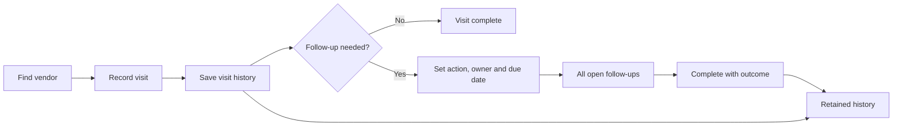

# VMS working-model and visit-history audit

**Date:** 2026-09-13. **Audited source:** `aed1a0a`, the restored twelve-module VMS candidate with Minimal theme/personal guides. **Audit branch:** `audit/vms-working-model`. **Verdict:** the module screens work, but the visit/follow-up workflow is not ready for unrestricted team rollout. Resolve the five high-priority items below first.

This is an audit, not approval of the proposed workflow changes. Application code, business rules and live data were not changed or deployed. Tests used isolated authenticated servers and standalone review fixtures. The production website and its actual accounts/data were not exercised in this audit; production still has the earlier VMS release. Findings apply to the inspected candidate unless stated otherwise.

## Executive findings

**15 consolidated findings: five high-priority, ten medium-priority.** The visit difficulty is real: generic interaction entry, forced reminders, incomplete visit history and queue behavior make routine visit reporting awkward or unreliable.

The existing **169 native tests and 92 browser checks passed on this run**. Those tests validate the implemented rules; they did not establish that those rules support every practical workflow. The additional **23 working-model scenarios produced 7 passes, 9 failures, 4 policy gaps and 3 capability/UX gaps**. Multiple scenarios sometimes reproduce the same consolidated finding. A reproduced weakness is not counted as a product pass. See [the execution ledger](VMS_WORKFLOW_AUDIT_CASES.md).

## Current visit workflow

1. Open VMS → Vendors, search and open a supplier.
2. Locate **Interactions & follow-ups** beneath the profile, evaluation and contacts.
3. Click **Add interaction**. The default type is **NOTE**, not Visit.
4. Change the type to VISIT; enter title, date, notes and attachments.
5. Enter a mandatory next follow-up date, even when recording a completed historical visit with nothing outstanding. It defaults to today.
6. Text-only entries go through the browser outbox. Entries with evidence upload files first and then use a separate command path.
7. History displays reverse insertion order. The follow-up queue selects only the latest dated interaction per supplier.
8. Update can complete/reschedule that interaction's follow-up. It cannot correct the actual visit entry. Completion remarks remain stored but are not shown in the readable profile history.

This combines three different jobs—recording what happened, scheduling future work and reporting completed work—in one form without enough separation.

## High-priority findings

### VMS-AUD-001 — An older open action disappears behind a newer interaction

**Type:** preserved source policy that does not support a full action queue. **Evidence:** WM-06; `shared/vms.mjs:vmsFollowups`, `web/vms.mjs` Dashboard/Follow-ups.

**Reproduction:** create an overdue factory-visit follow-up; add a newer courtesy call; complete the newer call. The old action is still open in storage, but the queue contains only the newer Completed row. Dashboard due counts use the same helper, so they can miss outstanding work.

**Impact:** a team member can believe the supplier has no pending work when a previous commitment remains unresolved. This is not deletion of history, but it is a material operational visibility gap.

**Recommendation:** show every open interaction follow-up. Keep a separate “latest contact” summary if useful. Completing one action must not hide another. This changes an established rule and needs a confirmed product decision; do not silently replace it.

### VMS-AUD-002 — The second offline visit for the same supplier is blocked

**Type:** implemented limitation that blocks normal field work. **Evidence:** WM-15; `web/vms-outbox.mjs:enqueue`.

**Reproduction:** disconnect, save a visit, then record another visit/interaction for the same vendor. Save stops with “This vendor already has a pending edit.” The guard applies to every `VMS_ADD_INTERACTION`, despite each interaction being an independent append.

**Recommendation:** allow multiple queued interactions with separate request IDs and chronological display. Retain stricter conflict control for profile replacement edits. Acceptance must include three unsynced visits, reconnect and lost-acknowledgement retries, with exactly three retained visits.

### VMS-AUD-003 — Attached visits can save while the screen reports failure

**Type:** confirmed recovery defect. **Evidence:** WM-18/19; `web/vms.mjs:submit`, `web/app.mjs:command/uploadMany`, `shared/vms.mjs:VMS_SYNC_EDIT`.

**Reproduction:** save a visit with evidence and drop the response after the server commits. The visit exists in the database, but the form says **Failed to fetch**. Pressing Save again returns HTTP 409 because the client revision is stale. The attachment path does not use the text interaction's idempotent reconciliation flow.

**Impact:** uncertain save status and manual recovery; re-entering after refresh can create a duplicate because normal interaction creation has no request identity. The audit directly reproduced the saved-but-failed display and 409, not an automatic duplicate.

**Recommendation:** use one idempotent final visit command for text and uploaded evidence, with pending/saved reconciliation and retained request ID. Refreshing must distinguish “already saved” from “not saved.” Preserve existing evidence scope checks.

### VMS-AUD-004 — Valid Indian “today” visits can be rejected after midnight

**Type:** confirmed date-boundary defect. **Evidence:** WM-05; server `occurredAt <= now.slice(0,10)` check.

**Reproduction:** at `2026-09-13T20:00:00Z` (01:30 IST on 14 September), record a visit dated 14 September. It is rejected as a future interaction. The UI also derives its default day from the existing UTC day helper.

**Recommendation:** explicitly define the VMS business timezone, expected here to be Asia/Kolkata, and use it consistently for current-day validation and due buckets. If visit time is added, retain the instant and timezone. Preserve historical date-only records without inventing visit times. Review other date dependencies before any global helper change.

### VMS-AUD-005 — A CRM notes-only save can undo a Vendor master location edit

**Type:** confirmed shared-data defect. **Evidence:** WM-07; `syncVmsPrimaryContact`, profile location IDs and `VMS_SAVE_PROFILE` location-name derivation.

**Reproduction:** select China → Zhejiang → Ningbo in CRM; change city to Shanghai through Vendor master; return to CRM and change only notes. Saving restores city Ningbo because the old district ID remains attached.

**Impact:** a legitimate master-data change is silently reversed by an unrelated update.

**Recommendation:** synchronize or invalidate linked geography IDs when master location text changes. A notes-only save must not rederive an unchanged location from stale references. Preserve the historical values in audit; do not bulk-rewrite vendors.

## Medium-priority findings

| ID | Finding and evidence | Practical correction |
|---|---|---|
| VMS-AUD-006 | **Visit entry is hard to discover.** No Record visit action in Vendors; the generic form is inside a long profile. WM-09. | Add Record visit to supplier rows/profile and the follow-up workspace. Open directly with VISIT selected and supplier fixed. |
| VMS-AUD-007 | **The visit model lacks operational context.** Only type/title/date/follow-up/notes/files; no visit time, person met, visited by, location, purpose or outcome. WM-10. These details can only be free text. | Keep a short form: date/time, summary, optional contact/place/outcome; default visited-by to the user but support explicitly attributed historical entry. Avoid making every field mandatory. |
| VMS-AUD-008 | **Historical visits require an artificial next action.** Next follow-up is mandatory and defaults to today; type defaults to NOTE. WM-04/11. Original source also required follow-up, but defaulted it seven days out. | Separate “Record visit” from an optional “Create follow-up.” Do not substitute another arbitrary default date. This is a product-policy change. |
| VMS-AUD-009 | **Backfilled history is out of chronological order.** A 10 September visit entered after a 12 September visit is shown first. WM-12. Native code reverses insertion; original source sorted occurrence date. | Sort by occurrence date/time, then deterministic created-at/ID ties. Show “recorded on” separately for backfills. |
| VMS-AUD-010 | **Completion outcomes are invisible.** Completion notes are persisted but absent from the profile and generic change-summary table. WM-13. | Display completion date, actor and remarks; preserve previous completion/reopen events. |
| VMS-AUD-011 | **Visit history has no correction or dedicated retrieval tools.** Update edits only the follow-up. No visit-date/type/text correction, visit-only/date-range filter, history export or history pagination. WM-14 and source inspection. | Add append-only corrections with reasons, filters/search and visit-history CSV. Preserve original entries; do not enable silent overwrite/deletion. Paginate long histories. |
| VMS-AUD-012 | **Rejected visit submissions leave orphan evidence.** A future-dated visit uploads one file and then fails validation; cancelling leaves the file without a visit link. WM-17. | Validate before upload and stage uploaded evidence until final commit; provide safe recovery/expiry for unused uploads. Files and records need explicit lifecycle handling. |
| VMS-AUD-013 | **Idle sync refresh discards unsaved settings.** Checking Show page guides without saving is undone by the 30-second empty-outbox sync render. WM-16. | Render only when relevant data/status changes; preserve dirty inputs and focus. Open modal forms are currently excluded, so this test does not imply their contents are lost. |
| VMS-AUD-014 | **Inactive catalogue entries accept new assignments.** New profile links to an inactive product are accepted. WM-08. | Retain old links, but distinguish historical availability from new selection. Confirm whether inactive entries should be blocked for new assignments before changing policy. |
| VMS-AUD-015 | **Mascot instructions still describe the former five-tab VMS.** `web/support.mjs:48` targets `main .tabs` and refers to Catalogues, while the candidate uses a submenu/module selector. Source inspection. | Update guide targets and copy for the twelve modules and the direct visit workflow; verify on vendor list, profile, follow-ups and mobile. |

## Proposed minimal working model — not yet approved or implemented

**Record visit:** vendor preselected; local visit date/time; short summary; optional person met, place and attachments. The actual visitor and the user recording the entry are distinguishable for backdated entries. The source already supports interaction types, so reuse its VISIT record rather than creating a parallel vendor database.

**Save:** show unambiguous Saved / Queued / Needs review. Allow several independent visit records in an offline outbox. Evidence uses the same final request identity after upload. Preserve input when the session expires or the connection drops.

**Next action:** explicit optional follow-up, with responsible person and due date. Initially one optional action per interaction is enough; a new multi-task architecture is not necessary to fix the current hidden-action problem. Show all open actions even when a newer visit exists. Keep creator/assignee/Manager authority consistent with existing permissions.

**History:** chronological visits with author, visitor, created-on timestamp, notes, files and completion/correction trail. Visits and follow-ups remain distinguishable. A correction records what changed and why; it does not erase the original visit. Old mandatory follow-ups are not automatically cleared during migration.

## Complete module coverage

| Module | Current evidence | Audit assessment |
|---|---|---|
| Dashboard | Route/reload, due summaries and native helpers | Operational gap: due counts inherit latest-only selection (001). |
| Vendor Follow-up | Search/status/sort, complete/reopen, actor restrictions | Core controls pass; hidden open actions and missing completion outcomes (001/010). |
| Vendors | Shared master, multiple contacts, profile, visits, evidence, linked POs | Visit UX/history/recovery and location defects (002–012). |
| Analytics | Grouped/ungrouped products, components/stages, drill-down | Counts and scope tests pass. These are sourcing relationships, not visit productivity reports or spend. |
| Expos & Fairs | Add/edit, year/date validation, supplier links | Catalogue works. Individual visits currently lack an expo/venue snapshot; historical event context is only profile/free text (007). |
| Product Lines | Groups, descriptions, links, CSV, retained inactive references | Works under current rules; clarify new assignments to inactive records (014). |
| Component Tags | Add/edit, links, coverage, CSV | Works under current rules; same inactive-selection policy applies. |
| Sourcing Risk | Product/component threshold tests, partial evaluation and scope | Existing distinct formulas pass. CRM grades do not grant Purchase approval. |
| Pending Sync | Auto reconnect, disjoint edits, conflicts, lost acknowledgements, storage-full retention, account isolation | Existing recovery checks pass for text/profile edits; multiple visit and idle-render defects remain (002/013). |
| Get the App | Manifest, public offline fallback and real reconnect | Warm-page offline text entry works. No offline business editing after a cold start, no offline evidence capture and no supplied native APK. Physical-device installation was not tested. |
| Users & Roles | Manager/Executive visit writes, Viewer denial, server role/scope/revision tests | Core permission boundaries pass. Shared native account/policy administration remains Admin-only. |
| Settings | Supporting editors, hierarchy validation, reference-rate isolation and personal guides | Stale location reconciliation, dirty preference reset and inactive selection need work (005/013/014). |

Samples, evaluations, file downloads, multiple small attachments and linked purchase history were covered by the rerun core VMS browser suite. Exactly **50 MiB** evidence successfully uploaded and linked in this audit; **50 MiB + 1 byte** was rejected before upload. The file-size limit itself is not the visit blocker. The earlier boundary attempt was confounded by the deliberately stale lost-acknowledgement session; it was rerun after a fresh bootstrap and passed.

## Repair order and acceptance

1. **Before field rollout:** resolve 001–005. Confirm the all-open-follow-up policy; allow independent queued visits; unify save reconciliation; fix VMS timezone and linked-location consistency.
2. **Make daily visit entry usable:** direct Record visit, optional next action, chronological history, visible outcomes and append-only corrections. Confirm policy changes before implementation. Reuse existing Minimal controls and retain role boundaries.
3. **Recovery and polish:** validate/stage attachments, preserve dirty settings, refresh mascot instructions, and settle inactive catalogue selection. Add visit filters/export and practical history pagination.
4. **Separate future scope:** offline cold-start editing/attachments, native APK, voice, legacy spreadsheet/PDF/XLSX/geography imports and historical VMS migration remain unavailable. Do not label the twelve restored screens as complete legacy feature parity.

Required retest scenarios: a completed historical visit with no next action; two older open actions plus a newer completed call; three offline visits to the same vendor; attached save with lost response; a rejected submission leaving no orphan file; IST midnight boundaries; master location edit followed by a notes-only save; complete/reopen/correct history; Manager/Executive/Viewer access; mobile and dirty-input preservation. Keep PO/PI currencies, financials and issued history unchanged.

## Evidence and limits

- Fresh native run: `test-output/vms-audit-native.log`, 169 passed.
- Fresh browser module run: `test-output/vms-parity-1789302277544/report.json`, 53 passed.
- Fresh browser core run: `test-output/vms-1789302277546/report.json`, 39 passed.
- Working-model run: `test-output/vms-working-audit-1789302677011/report.json`, 23 completed scenarios; screenshots of visit form/history/mobile; synthetic SQLite and evidence retained in the same ignored directory.
- Reproduction runner: `scripts/audit-vms-working-model.mjs`. It reports current product weaknesses without treating them as passes. No application fix is bundled into the audit.
- Historical screenshots/reports are not substituted for these runs. Actual production users, infrastructure/restore drills, physical mobile installation and high-concurrency/load testing were outside this run. Financial fixture collections remained unchanged; no real team/vendor data or credentials are present in the committed report.

No deployment or policy activation was performed. Recommended corrections above are proposals; audit results are not confirmation of new binding business rules.
