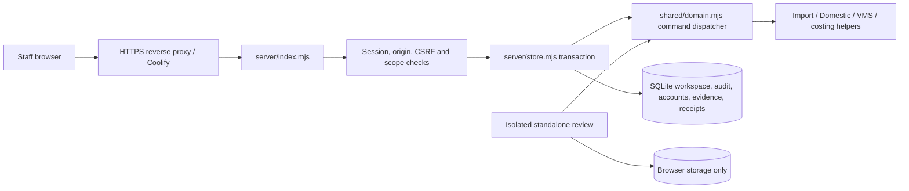

# System architecture

Observed 2026-09-26; source baseline `1297840`. This is an implementation map, not a new framework decision. Current module status is in [Current state](../handover/CURRENT_STATE.md).

## Runtime and boundaries

A modular application built with vanilla browser JavaScript ESM, native Node HTTP and synchronous SQLite. `package.json` declares no npm dependencies; browser JSZip is vendored, so “no npm dependencies” does not mean “no third-party code.” Node >=22.16 is declared; the Docker image uses Node 24. The active VMS is native code in this application. `vms-reference/` is recovered React/Express/Prisma reference material and is excluded from deployment.

| Area | Current owner and behavior |
|---|---|
| Browser shell | `web/app.mjs`: HTML-string rendering, delegated events, modal/form helpers, local search, pipeline paging, hash navigation and API adapter |
| Module navigation | `web/navigation.mjs`: Order Management divisions, VMS, shared administration; Domestic is separate from Import |
| UI modules | `web/domestic*.mjs`, `web/vms*.mjs`, `web/arrival-costing.mjs`, `web/process-exemptions.mjs`; shared Minimal CSS, theme, support/mascot |
| Business authority | `shared/domain.mjs:execute` validates authenticated actors, clones state, dispatches module commands, records events and advances revision |
| Domain helpers | `shared/domestic*.mjs`, `vms.mjs`, `plm.mjs`, `shipping.mjs`, `references.mjs`, `arrival-costing.mjs`, `process-exemptions.mjs`, `order-progress.mjs` |
| Transport/storage | Native HTTP, prepared SQL, serialized transactions; details in [Data architecture](DATA_ARCHITECTURE.md) |
| Deployment | Root Dockerfile copies server/shared/web/templates, runs non-root on port 8000; persistent `/app/data`; documented single instance |
| Build | Server serves ESM directly. `scripts/build.mjs` creates an isolated review HTML by stripping imports/exports and concatenating an explicit module list |
| Jobs | No durable server job queue or scheduler in the active runtime. Imports, exports, calculations and document preparation use request/browser paths |
| Cache/offline | API and protected files use no-store. Service worker caches only public reconnect HTML. VMS text outbox is per-login localStorage, retrying on reconnect/30-second timer; it is not a general offline application |
| Integrations | Admin common-reference JSON export and external ID mapping exist. No active Tally posting, external VMS synchronization, bank execution, AI help API or automatic exchange-rate feed |
| Operations | Readable-workspace health, Docker healthcheck, optional source SHA, redacted slow/5xx request logs and business audit (DEC-084); external alerting/distributed tracing not configured |

## API surface

| Method/path | Responsibility |
|---|---|
| GET /api/health | Checks readable workspace revision; 200/503, version/sqlite storage and validated optional releaseSha. Not a write/disk/integrity test |
| POST /api/login, /api/logout | Same-origin local authentication/session lifecycle |
| GET /api/bootstrap | Entire scoped state, actor, CSRF token and opaque edit-context handle |
| GET /api/revision | Authenticated workspace revision; browser polls every 15 seconds/on focus when safe |
| POST /api/commands | Command type/payload, expected revision, optional edit context and idempotency key |
| GET/POST /api/users | Admin account listing/creation |
| POST /api/files, GET /api/files/:id | Validated, scoped evidence upload/download |
| GET /api/requests/:id | Actor-bound durable request-result reconciliation |
| GET /api/integration/v1/snapshot | Admin common integration snapshot, not Tally-native input |

Responses follow the existing JSON/error/status contract. UI pagination does not bound bootstrap or export data. Static routes use an allowlist; new browser imports must be added to both server serving and review bundling. Protected Domestic pictures require login/scope.

## Authentication and trust

Passwords use salted scrypt; sessions store hashed random tokens and expire after eight hours. Cookies are HttpOnly/SameSite=Strict; Secure depends on runtime configuration. Writes check exact Origin, then CSRF except login. Roles/scopes are re-read from current profiles, not trusted from the client. Domain enforcement is authoritative; hiding a button is insufficient.

Login rate limiting is process-local by socket address; proxy behavior and distributed protection are not verified by source inspection. CSP, nosniff and frame/referrer restrictions exist. Uploads validate extension, filename, base64 and a 50 MiB body limit; no content-signature/malware scan is implemented. Upload bodies are fully buffered. See the risk register, not a claim of penetration-test clearance.

## Independent review mode

The standalone HTML runs the same domain rules but simulates roles, stores state locally and keeps evidence in IndexedDB. It is not authentication and cannot prove server security. Review schema mismatches can reset review state; production migrations must never copy that behavior. Synthetic preview state is explicitly separate from a production release.

## Maintainability observations

`web/app.mjs` is approximately 269 kB and `shared/domain.mjs` 132 kB, with dense long functions; new module factories already provide a useful extraction pattern. The manual build list and regex stripping are fragile coupling points. Targeted extraction and build characterization are preferable to a framework rewrite. Known issues and acceptance criteria live in [Technical debt](../handover/TECHNICAL_DEBT.md).
